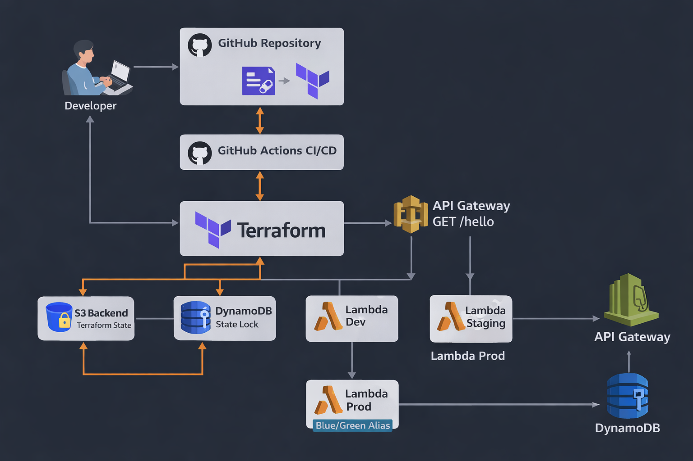

# Serverless CI/CD Pipeline with Terraform

A production-ready Serverless CI/CD pipeline built using Terraform and GitHub Actions to deploy AWS Lambda and API Gateway across Dev, Staging, and Production environments with Blue/Green deployment strategy.

----
## Project Overview

This project demonstrates an end-to-end Serverless CI/CD pipeline using Infrastructure as Code (IaC) principles.

The pipeline automates:
- Infrastructure provisioning using Terraform
- Continuous deployment using GitHub Actions
- Environment-based deployments (Dev, Staging, Prod)
- Blue/Green deployment strategy for Production

Each environment exposes a single API Gateway endpoint (`GET /hello`) that triggers its respective AWS Lambda function.

----
## Architecture Overview

The architecture follows a serverless and fully automated CI/CD approach:

- Source code is stored in a GitHub repository
- GitHub Actions triggers Terraform workflows on code changes
- Terraform provisions AWS infrastructure across environments
- API Gateway exposes a REST endpoint (`GET /hello`)
- API Gateway invokes environment-specific AWS Lambda functions
- Terraform state is stored remotely in Amazon S3
- DynamoDB is used for Terraform state locking to prevent concurrent changes

Production uses a Blue/Green deployment strategy with Lambda aliases to enable safe traffic switching.

------
## Architecture Diagram

The following diagram illustrates the complete CI/CD and serverless architecture implemented in this project.



-----
## Technologies Used

- AWS Lambda
- Amazon API Gateway (REST API)
- Terraform
- GitHub Actions
- Amazon S3 (Terraform remote backend)
- Amazon DynamoDB (Terraform state locking)
- Python 3.11

-----
## Repository Structure

The repository is organized using reusable Terraform modules and environment-specific configurations.

```text
.
├── terraform/
│   ├── modules/
│   │   ├── lambda/
│   │   └── api-gateway/
│   └── environments/
│       ├── dev/
│       ├── staging/
│       └── prod/
├── .github/
│   └── workflows/
│       └── deploy.yml
├── docs/
│   └── architecture.png
└── README.md

```
------
## Environments

The project is deployed across three isolated environments:

| Environment | Deployment Type | Description |
|------------|-----------------|-------------|
| Dev | Automatic | Deployed on feature branch push |
| Staging | Manual approval | Validation before production |
| Prod | Blue/Green | Zero-downtime deployment |

------
## CI/CD Pipeline Flow

The CI/CD pipeline is implemented using GitHub Actions and follows this flow:

1. Developer pushes code to the GitHub repository
2. GitHub Actions workflow is triggered
3. Terraform initializes and applies infrastructure changes
4. Dev environment is deployed automatically
5. Staging deployment requires manual approval
6. Production deployment uses Blue/Green strategy

-----
## GitHub Actions Workflow Behavior

The GitHub Actions workflow controls deployments based on branch rules:

- Pushes to `feature/*` branches trigger **Dev** deployment automatically
- Pushes to the `main` branch trigger **Staging** deployment
- Staging deployment requires **manual approval**
- After approval, **Production** deployment is executed using Terraform

------
## Secrets Configuration

AWS credentials are securely managed using GitHub Secrets and are never hardcoded in the repository.

The following secrets are configured in the GitHub repository:

- `AWS_ACCESS_KEY_ID`
- `AWS_SECRET_ACCESS_KEY`

These secrets are used by GitHub Actions to authenticate with AWS during Terraform deployments.

------
## Terraform Remote Backend (S3 & DynamoDB)

Terraform state is managed remotely to ensure safe and consistent deployments across environments.

- **Amazon S3** is used to store Terraform state files
- **Amazon DynamoDB** is used for state locking to prevent concurrent Terraform executions

Each environment uses a separate Terraform state file stored in S3.

-----
## S3 Backend Structure

Terraform state files are organized in Amazon S3 by environment to maintain isolation.

```text
serverless-cicd-terraform-state/
├── dev/
│   └── terraform.tfstate
├── staging/
│   └── terraform.tfstate
└── prod/
    └── terraform.tfstate
```
-----
## API Gateway Configuration

Each environment (Dev, Staging, Prod) has its own API Gateway REST API.

- A single endpoint is exposed: `GET /hello`
- API Gateway triggers the corresponding AWS Lambda function
- Separate stages are created for each environment
- The default API Gateway invoke URL is used

----
## Lambda Function Configuration

AWS Lambda is used to implement the serverless backend logic.

- A separate Lambda function is deployed for each environment
- Runtime: **Python 3.11**
- The function returns a simple JSON response identifying the environment
- Environment variables are used to indicate environment and version
- Lambda functions are deployed and managed entirely using Terraform

------
## Blue/Green Deployment (Production)

The Production environment uses a Blue/Green deployment strategy to ensure zero downtime.

- Lambda function versions are published on each deployment
- Two Lambda aliases are used:
  - **blue** → previous stable version
  - **green** → newly deployed version
- API Gateway invokes the Lambda alias instead of a fixed version
- Traffic is shifted by updating the active alias
- This allows instant rollback if issues occur

------
## Deployment Verification

After deployment, the setup is verified using the following steps:

1. Confirm GitHub Actions workflow completes successfully
2. Verify API Gateway stages exist for dev, staging, and prod
3. Confirm Lambda functions and aliases are created
4. Invoke the API endpoint using the browser or curl

Example API call:
```curl https://<api-id>.execute-api.us-east-1.amazonaws.com/prod/hello
```
A successful response returns a JSON message indicating the environment and version.

-----
## Required Screenshots

The following screenshots are included as proof of successful implementation:

1. GitHub Actions workflow showing successful pipeline execution
2. Dev environment deployment success
3. Staging environment manual approval and deployment
4. Production deployment with Blue/Green strategy
5. API Gateway stages for dev, staging, and prod
6. Lambda functions list for all environments
7. Lambda aliases showing active Green version in production
8. Successful API response from `/hello` endpoint
9. S3 bucket containing Terraform state files
10. DynamoDB table used for Terraform state locking

------
## Conclusion

This project demonstrates a production-grade serverless CI/CD pipeline using Terraform and GitHub Actions.

Key highlights include:
- Fully automated infrastructure provisioning using Terraform
- Secure and reliable Terraform state management using S3 and DynamoDB
- Multi-environment deployment strategy (Dev, Staging, Prod)
- Manual approval gate for Staging deployments
- Zero-downtime Production deployments using Blue/Green strategy

This setup reflects real-world DevOps and cloud engineering best practices.
